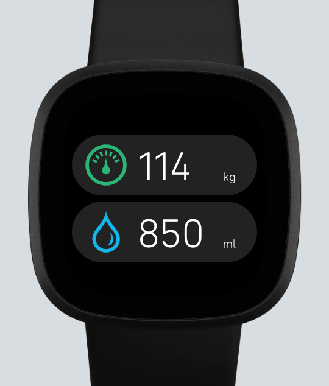
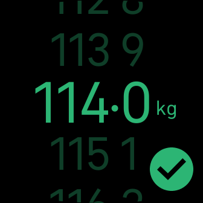
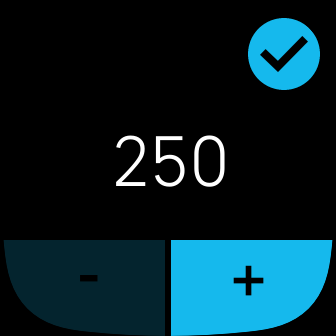

# Fitbit Log

Fitbit Log for Weight and Water, designed for Versa 3 and Versa 4.

Quick and convenient way to log your weight and daily water consumption.

🚧 This is a work-in-progress. 🚧

## Screenshots

| Weight                                | Water                           |
|-----------------------------------------|-------------------------------|
|  |  |

## Notes

- Requires an application to be registered with Fitbit, set the `FITBIT_CLIENT_ID` and `FITBIT_CLIENT_SECRET` in `common/oauth.secret.ts`.
- You must have atleast one recent weight log that has been entered via the Fitbit Companion app for the weight logger to initialise the values from.
